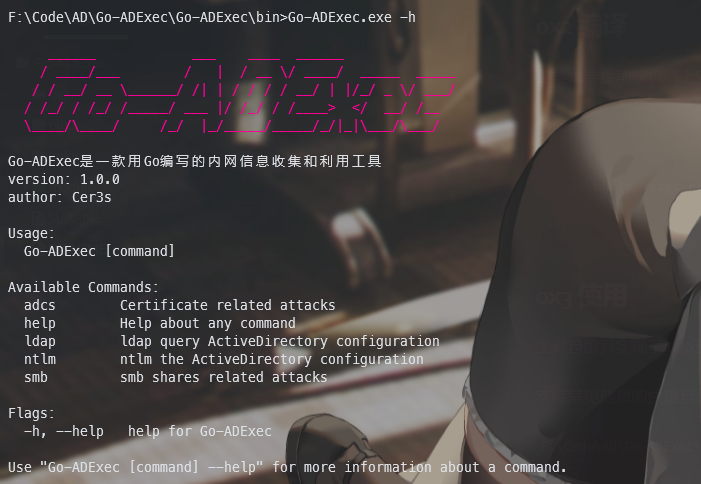
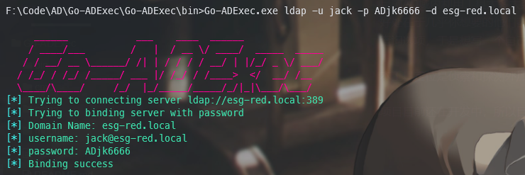
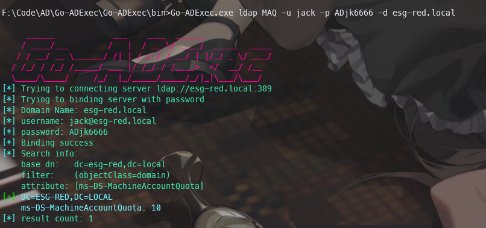
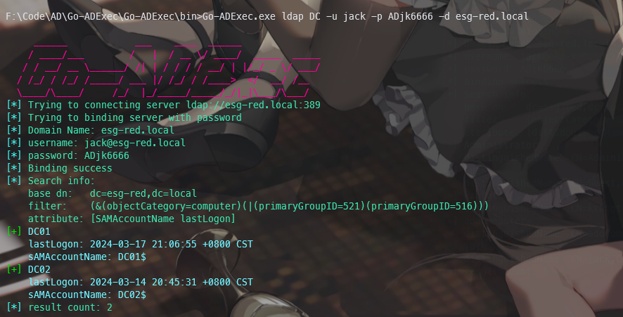
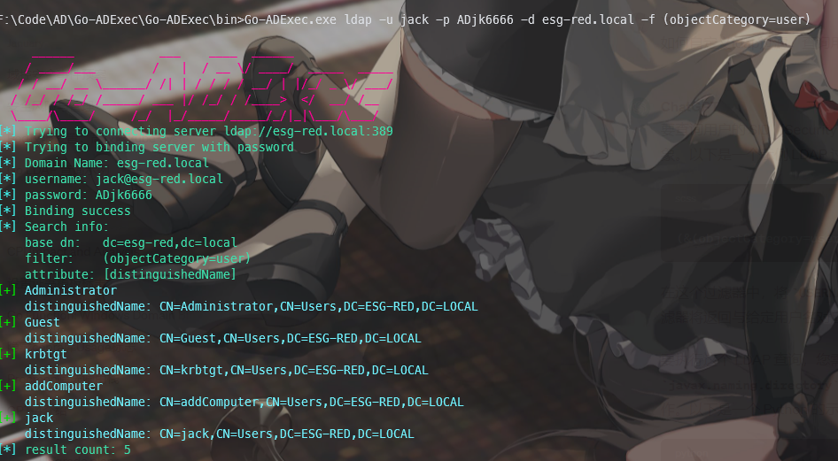
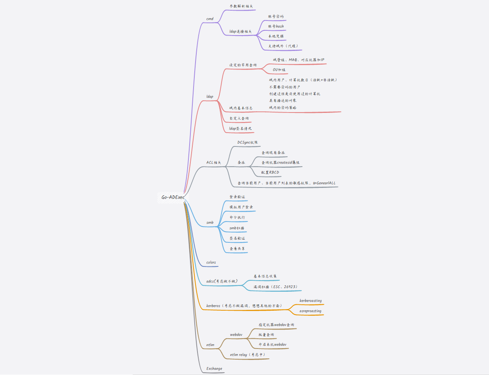

# Go-ADExec

## 0x1 介绍
项目初衷是练习Go语言以及想写一个符合个人习惯的内网渗透工具


目前AD域内利用工具太多太杂，其中最为优秀的是以Impacket和nxc（原cme）为代表的一系列工具，但是他们都有同一个问题，就是功能太多太杂了。好处在于几乎你想要的他们都有，但坏处在于（就我而言），很多想要的功能分布在不同的工具中，我需要不同工具切来切去使用、且没有快捷自定义的功能或者查询选项，于是想写一个自己使用的工具

本工具定位是侦察和探测外加一些实用的小功能，不会集成类似于大规模扫描和漏洞利用功能

项目目前还在开发中，所以目前只实现了一些基本的功能，


## 0x2 编译

工具需要提前在机器上安装Go环境

编译选项：
```
go build -tags release -ldflags "-s -w -extldflags '-static'" -trimpath -o bin/Go-ADExec.exe
```


## 0x3 使用

工具目前只实现了ldap查询相关部分功能



支持常见信息的快捷查询和自定义属性的查询，支持账号密码和hash认证，支持Windows本地凭据认证，支持ldaps（前提域控支持）


在不使用某一功能时，默认是测试ldap连接



BaseInfo目前是统计域内计算机和用户数量，后续考虑显示的更加详细以及加上其他选项


查询域内MAQ



查询域控



利用`-f`参数自定义查询




## 0x4 计划

上导图！



上面是之前考虑想做的点，目前是第一版

- adcs可能不会做信息收集和漏洞相关的，这方面Certipy已经相当出色了
- 感觉还是继成一些小trik之类的吧
- 希望我不鸽🙏
- ......
